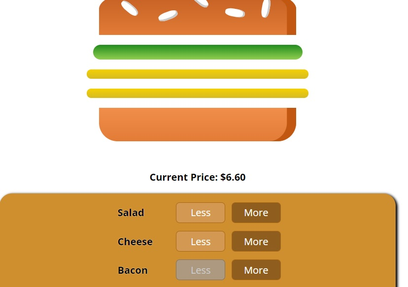

# BurgerBuilderApp

## Demo

[**click live demo of the project**](https://dominiksiejka.github.io/YouTubeApp/)



## Table of Contents

- [About the Project](#description)
- [How to use](#how-to-use)
- [Technologies used](#built-with)
- [Setup steps](#setup)
- [Sources](#sources)
- [License](#license)

## Description

BurgerBuilderApp this is an application which allows you to order delicious burger made with all ingrediants you want. There is a cool animation after you add each available ingrediant the burger get bigger. After you build your perfect burger there is a summary of ingrediants with a total price. Then you can visit the checkout page and contact form which sends the data to firebase backend server.

## How to use

First of all choose the ingrediants you would like to have on your burger. You can choose up to 6 ingrediants. Then click the order button. The order summary will pop up with all ingrediants you have choosen and the total price of the burger. Then you can continue to checkout or cancel the proccess. After you reach a checkout page you need to click continue and the contact form will become visible. Fill in all informations and that's it you just made an order.

## Built with

- React
- React Router
- CSS modules
- Axios
- Firebase

## Setup

```
with BASH

# clone the remote repo to your local one
$ git clone https://github.com/dominiksiejka/YouTubeApp.git

# open the index.html file or use your code editor to open it with live server

```

## Sources

- Icons from [Font Awesome ](https://fontawesome.com)
- Font from [Google Fonts ](https://fonts.google.com/)

## License

- MIT © [Dominik Siejka ](https://github.com/dominiksiejka/YouTubeApp)
